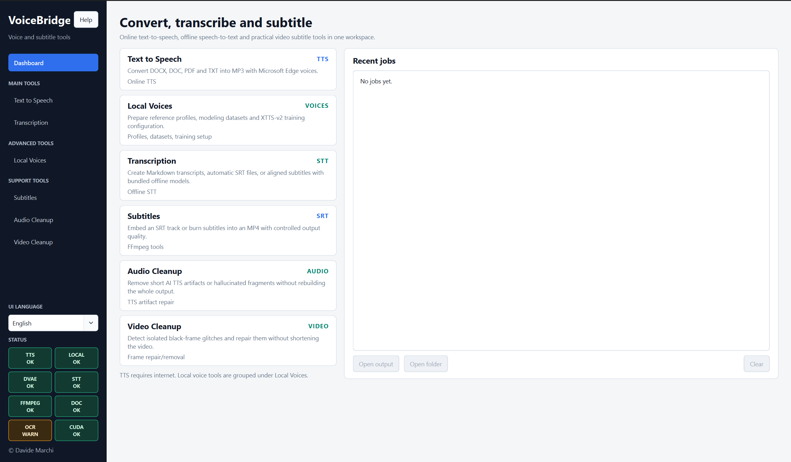

# VoiceBridge

[](https://github.com/beastmen84/voicebridge/actions/workflows/ci.yml)

VoiceBridge e' un'app desktop Windows per trasformare documenti in audio, trascrivere audio/video, creare sottotitoli e fare piccoli interventi di cleanup su audio e video.

Versione corrente: `1.0`.

La guida utente stampabile e' in [Manual.it.html](Manual.it.html) e [Manual.en.html](Manual.en.html), con switch in testa tra Italiano e English.

## Funzioni principali

- Text to Speech online con Microsoft Edge TTS.
- Local TTS opzionale con profili vocali autorizzati e Coqui XTTS-v2, soggetto a limitazioni non commerciali.
- TTS singola voce o multi-voce a blocchi, con output MP3 unico e timeline JSON dei blocchi.
- Gestione profili vocali locali, dataset per voice modeling, setup e training XTTS-v2.
- Generazione locale di testi guidati e sicuri per dataset vocali multilingua, con verifica Whisper in background.
- Speech to text offline con WhisperX e Whisper `large-v3`.
- Transcript Markdown, sottotitoli `.srt` automatici e sottotitoli da transcript fornito.
- Embed o burn-in di sottotitoli su video.
- Audio Cleanup manuale con taglio, silenziamento e fade su range selezionati.
- Video Cleanup con filmstrip manuale, detect opzionale dei frame neri, detect di frame sospetti via OpenCV e coda di modifiche Freeze/Remove.

## Screenshot



Non aggiornare lo screenshot con file, nomi profilo o percorsi locali personali visibili.

## Pacchetto distribuito

La cartella da distribuire e avviare e':

```powershell
dist\VoiceBridge
```

Avvio:

```powershell
dist\VoiceBridge\VoiceBridge.exe
```

Distribuire sempre tutta la cartella `VoiceBridge`, non solo l'eseguibile.

Il bundle include runtime e strumenti necessari, ma il build standard non copia `models` dentro `dist\VoiceBridge` per evitare duplicazioni da molti GB.
La versione app distribuita e' indicata nel file `VERSION` e nel footer della sidebar.
I modelli vengono risolti in questo ordine:

1. `dist\VoiceBridge\models`, se esiste e contiene modelli validi.
2. `models` nella root del progetto sorgente, quando si esegue il dist creato dentro al progetto.
3. Download dall'app, se nessuna cache valida viene trovata.

Il bundle puo' includere:

- runtime Python ML condiviso in `python-ml`
- modelli in `models`
- Whisper `large-v3`
- allineamento WhisperX per sottotitoli
- Coqui XTTS-v2 e asset training opzionali
- ffmpeg tramite `imageio-ffmpeg`
- OpenCV headless nel runtime ML per il detect dei frame video sospetti

La cartella `models` puo' essere distribuita manualmente oppure lasciata assente. In quel caso l'app mostra i pulsanti di download per i prerequisiti mancanti, come Whisper `large-v3`, XTTS-v2 e asset training XTTS.

## Requisiti utente

Per l'uso normale del pacchetto onefolder non serve installare Python.

- Risoluzione minima attuale consigliata: Full HD, `1920x1080`. Su display Windows `1920x1080` con scaling oltre 100%, l'app forza temporaneamente il layout Qt a 100% per mantenere usabile la UI.
- Edge TTS richiede connessione internet.
- Local TTS, Transcription, Subtitles, Audio Cleanup e Video Cleanup funzionano offline dopo aver incluso runtime, modelli, ffmpeg e runtime ML con OpenCV per il detect dei frame sospetti.
- Microsoft Word serve solo per leggere vecchi file `.doc`.
- Tesseract OCR serve solo per OCR su PDF scansionati.

## Privacy / dati locali

VoiceBridge e' progettata come app desktop locale: documenti, audio, video, profili vocali, dataset, export e job restano sul disco dell'utente, salvo uso esplicito di servizi o download online.

- Edge TTS usa il servizio online Microsoft Edge TTS: il testo da sintetizzare viene inviato al servizio remoto.
- STT, Local TTS, Voice Modeling, Audio Cleanup e Video Cleanup lavorano localmente quando runtime, modelli e strumenti richiesti sono gia' disponibili.
- Download di modelli e asset opzionali possono contattare sorgenti remote come Hugging Face, Coqui o repository dei rispettivi pacchetti.
- I profili vocali, i dataset di modeling e gli output generati possono contenere dati personali o biometrici vocali. Non committarli e non pubblicarli.
- Dopo un training XTTS completato, VoiceBridge mantiene il modello utilizzabile in `inference_model`, archivia i log in `logs\voice_modeling` e rimuove i checkpoint intermedi in `run\training` per evitare accumuli da molti GB.
- La build locale preserva `voice_profiles`, `modeling_exports` e `voice_models` dentro `dist\VoiceBridge`, ma per distribuzioni pubbliche e' preferibile partire da una cartella pulita senza dati utente.

## Licenze modello e uso commerciale

Il codice di VoiceBridge usa licenza MPL-2.0. Le dipendenze, i runtime e i modelli di terze parti mantengono le rispettive licenze.

Nota importante: XTTS-v2 usa la Coqui Public Model License. Modello, asset e output XTTS-v2 sono limitati a uso non commerciale. Verificare la licenza corrente prima di distribuire modelli, voci generate o workflow commerciali.

## Ambiente sviluppo

L'app principale usa la venv `.venv`.

```powershell
py -3.14 -m venv .venv
.\.venv\Scripts\python.exe -m pip install -r requirements.txt
.\.venv\Scripts\python.exe -m pip install pyinstaller
```

OCR opzionale:

```powershell
.\.venv\Scripts\python.exe -m pip install -r requirements-ocr.txt
```

STT, Local TTS e Voice Modeling possono usare una venv ML condivisa Python 3.13:

```powershell
py -3.13 -m venv .venv-ml
.\.venv-ml\Scripts\python.exe -m pip install -r requirements-stt.txt
.\.venv-ml\Scripts\python.exe -m pip install -r requirements-local-tts.txt
```

Gli snapshot in `dev\venv-snapshots` sono solo freeze di audit/ripristino dell'ambiente ML usato in sviluppo.
Non sono requirements ufficiali di installazione: i file di installazione restano `requirements-stt.txt` e
`requirements-local-tts.txt`.

Preparazione modelli STT:

```powershell
.\.venv-ml\Scripts\python.exe .\prepare_stt_models.py
```

## Struttura codice

- `voicebridge_qt.py`: entrypoint Qt/PySide6 usato anche da PyInstaller.
- `voicebridge/main_window.py`: finestra principale, stato applicativo, settings e wiring dei workflow.
- `voicebridge/pages/`: builder delle pagine e workflow UI per TTS, STT, sottotitoli, Local Voices e cleanup.
- `voicebridge/ui/`: widget, helper UI e stylesheet Qt.
- `voicebridge/constants.py`: label, opzioni e costanti condivise.
- `voicebridge/app_paths.py`: percorsi runtime, bundle, modelli e risorse.
- `voicebridge/audio_recorder.py`: registrazione microfono via `sounddevice`.
- `voicebridge/tts_engine.py`: generazione Edge TTS, suffissi MP3 e cancellazione TTS.
- `voicebridge/media_tools.py`: ffmpeg, merge MP3, sottotitoli e cleanup audio/video.
- `voicebridge/video_anomalies.py`: classificazione dei frame sospetti usata dal Video Cleanup.
- `voicebridge/stt_preflight.py`: controlli bundle STT, modelli e ffmpeg.
- `voicebridge/readers.py`: lettura documenti, PDF, OCR opzionale e rilevamento lingua.
- `local_tts_worker.py`: worker Coqui XTTS eseguito dal runtime ML.
- `stt_worker.py`: worker WhisperX eseguito dal runtime ML.
- `voice_modeling_worker.py`: worker per preparazione e training XTTS-v2.
- `video_anomaly_worker.py`: worker OpenCV per rilevare frame sospetti nei video.
- `prepare_stt_models.py`: script di preparazione/download dei modelli STT.

## Build

Build veloce app/exe, preservando runtime ML e modelli gia' presenti in `dist`:

```powershell
.\build_app.ps1
```

Sincronizzare solo runtime ML:

```powershell
.\sync_stt_bundle.ps1 -RuntimeOnly
```

Sincronizzare manualmente anche i modelli nel dist, solo se si vuole creare un bundle completamente offline:

```powershell
.\sync_stt_bundle.ps1 -ModelsOnly
```

Build completo standard, senza copia dei modelli:

```powershell
.\build_exe.ps1
```

Build completo pulito:

```powershell
.\build_exe.ps1 -Clean
```

Il README, `Manual.it.html`, `Manual.en.html`, `VERSION`, la licenza e `THIRD_PARTY_LICENSES` vengono copiati nella cartella `dist\VoiceBridge` durante la build.

## Licenza

Il codice di VoiceBridge e' distribuito con licenza MPL-2.0. Vedere [LICENSE](LICENSE).

Le librerie, i runtime e i modelli di terze parti inclusi o usati dall'app mantengono le rispettive licenze. Vedere [THIRD_PARTY_LICENSES](THIRD_PARTY_LICENSES).

Per XTTS-v2 vedere anche la sezione "Licenze modello e uso commerciale".
